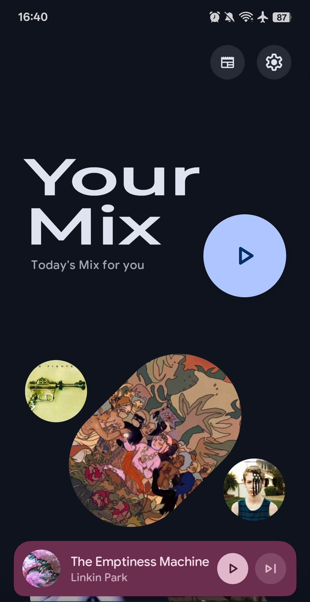
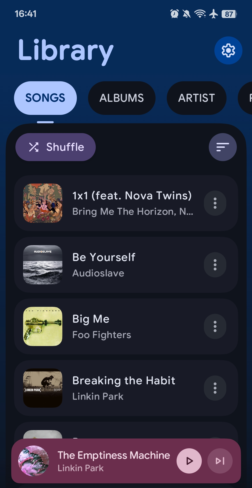
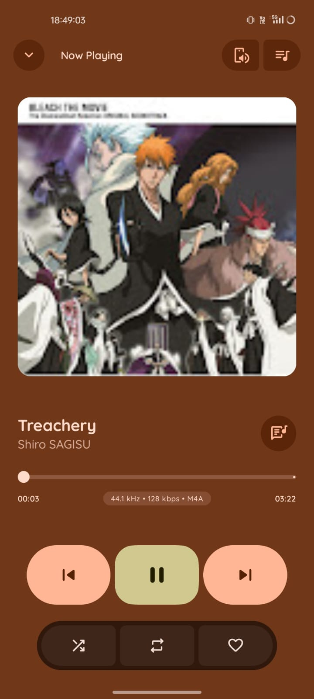
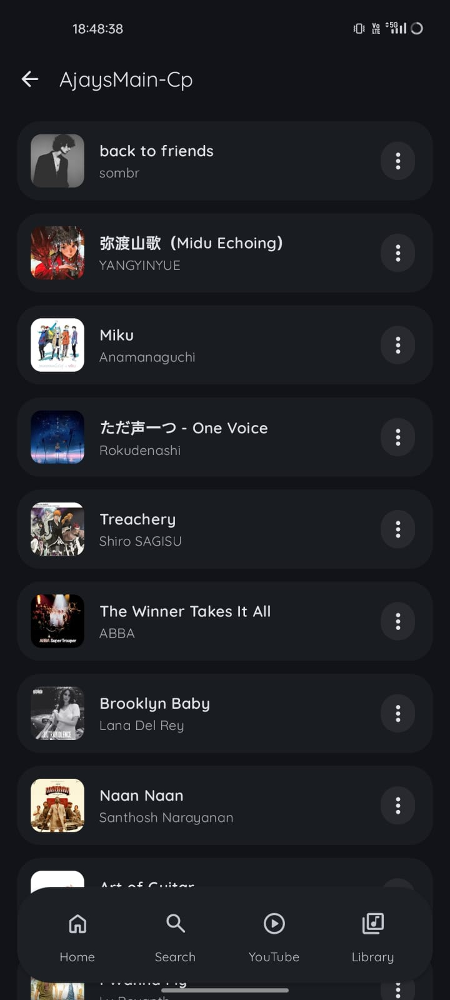
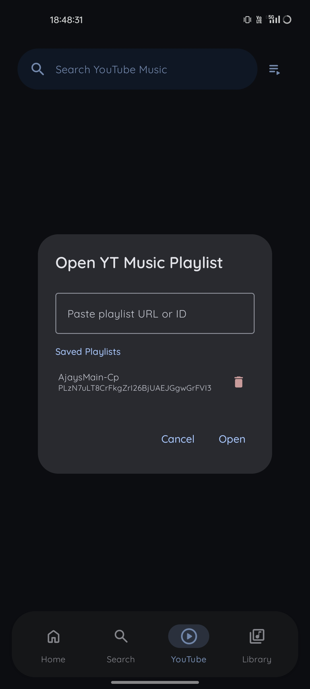
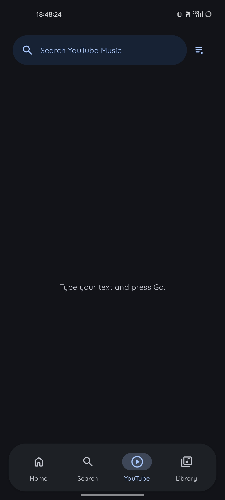

# AKR - PixelPlayer 🎵

<p align="center">
  
</p>

<p align="center">
  <strong>A modern, ultra-responsive music streaming & local playback powerhouse for Android & Wear OS.</strong><br>
  Crafted with Jetpack Compose, Material Design 3, Media3 ExoPlayer, and high-performance cloud integrations.
</p>

<p align="center">
    <a href="https://github.com/ajaykumarreddy-k/AKR-PixelPlayer/releases/latest">
        
    </a>
    <a href="https://github.com/ajaykumarreddy-k/AKR-PixelPlayer/releases">
        
    </a>
    
    
    
</p>

---

## ⚡ What's New & Performance Highlights

- ⚡ **Ultra-Low Latency YouTube Streaming**: Reduced track startup latency from ~2–3s down to **<400ms** (and near-instantaneous on cached tracks).
- 🏎️ **Concurrent InnerTube Stream Racing**: Parallelized multi-client resolution (Android VR + iOS InnerTube endpoints with ExoPlayer fallback) to guarantee the fastest audio stream wins.
- 🚀 **Pre-Warmed Decipher Pipeline**: Pre-warms `signatureTimestamp` and decipher player scripts in the background on startup, completely eliminating cold-start delays.
- ⏭️ **Zero-Delay Next/Previous Playback**: Queue engine resolves adjacent tracks concurrently in background threads so skipping tracks is instant and buffer-free.
- 🎨 **Refreshed Visual Identity**: Brand-new app logo and adaptive launcher icons (round, monochrome, high-res mipmaps) across phone and Wear OS clients.
- 🛡️ **Streamlined UI Architecture**: Removed blocking UI resolution chains and intermediate toasts for seamless one-tap playback.

---

## 📸 Screenshots

### Mobile App
<p align="center">
  
  
</p>

### Wear OS & Output Routing
<p align="center">
  
  
  
  
</p>

---

## ✨ Key Features

### 🎨 Modern UI/UX
- **Material You Design** - Dynamic colors extracted from wallpaper and album artwork.
- **Fluid Micro-Animations** - Smooth transitions, responsive gestures, and customizable navigation bar corner radiuses.
- **Dark & Light Themes** - Seamless automatic or manual switching.

### 🎵 High-Fidelity Audio Engine
- **Media3 ExoPlayer + FFmpeg** - Studio-grade audio decoders supporting MP3, FLAC, AAC, OGG, WAV, ALAC, and OPUS.
- **Gapless Playback & Crossfade** - Seamless transitions between tracks with configurable fade curves.
- **Integrated Equalizer** - High-precision multi-band equalizer with bass boost and virtualizer.
- **Background Playback** - Full Android MediaSession integration with lockscreen controls.

### 🔗 Cloud Streaming & Synchronized Services
- **YouTube & YouTube Music** - High-speed search, playlists, related songs, and ultra-low latency playback powered by InnerTube.
- **Telegram (TDLib)** - Stream and sync audio directly from your Telegram chats and channels.
- **NetEase & QQ Music** - Browse and stream from leading Asian streaming services.
- **Navidrome & Subsonic** - Link your personal self-hosted music servers.
- **Jellyfin** - Stream from your Jellyfin media libraries.

### ⌚ Wear OS Companion Application
- **Wrist Controller** - Browse playlists, control playback, and adjust volume on the go.
- **Offline Mode** - Download and store audio files directly onto the watch for phone-free workouts.
- **Synchronized Lyrics** - Follow synchronized LRC lyrics right on your wrist.
- **Dynamic Output Routing** - Effortlessly switch audio output between Phone, Watch Speaker, and paired Bluetooth headphones.

### 🤖 AI-Powered Intelligence
- **AI Playlist Generator** - Generate smart playlists from natural language prompts using Gemini, DeepSeek, or OpenAI models.
- **Daily Mix** - Personalized daily mixes shaped by your listening habits.
- **AI Lyrics Translation** - Translate synchronized lyrics on-the-fly across multiple languages.

### 🛠️ Advanced Tools
- **Tag Editor** - Edit audio metadata with TagLib & JAudioTagger (supports MP3, FLAC, M4A).
- **Synchronized Lyrics (LRC)** - Real-time lyrics fetched via LRCLIB and custom providers.
- **Glance Home Widgets** - Beautiful interactive widgets for your home screen (4x1, 4x2, 2x2).
- **Casting Support** - Cast audio to smart TVs and wireless speakers via built-in Ktor CIO server.

---

## 🛠️ Tech Stack

| Category | Technology |
|----------|------------|
| **Language** | [Kotlin](https://kotlinlang.org/) 100% |
| **UI Framework** | [Jetpack Compose](https://developer.android.com/jetpack/compose) + Compose for Wear OS |
| **Design System** | [Material Design 3](https://m3.material.io/) |
| **Audio Engine** | [Media3 ExoPlayer](https://developer.android.com/guide/topics/media/media3) + FFmpeg Extension |
| **Architecture** | Modern Android Architecture (MVVM + StateFlow / SharedFlow) |
| **Dependency Injection** | [Hilt](https://dagger.dev/hilt/) |
| **Local Database** | [Room](https://developer.android.com/training/data-storage/room) |
| **Networking** | [OkHttp](https://square.github.io/okhttp/) + [Retrofit](https://square.github.io/retrofit/) |
| **Image Loading** | [Coil](https://coil-kt.github.io/coil/) |
| **Concurrency** | Kotlin Coroutines & Flow |
| **Metadata** | [TagLib](https://github.com/nicholaus/taglib-android) + JAudioTagger |
| **Home Widgets** | [Glance](https://developer.android.com/jetpack/compose/glance) |
| **Casting / Server** | [Ktor](https://ktor.io/) CIO Engine |
| **Cloud Integrations** | [TDLib](https://github.com/tdlib/td) (Telegram), InnerTube (YouTube Music) |
| **AI Integration** | [Google Generative AI SDK](https://github.com/google/generative-ai-android) |

---

## 📱 System Requirements

- **Android Version**: Android 11 (API level 30) or higher
- **RAM**: 4GB minimum (6GB+ recommended)
- **Wear OS**: Wear OS 3.0+ for companion features

---

## 🚀 Getting Started

### Prerequisites

- [Android Studio Ladybug (2024.2.1+)](https://developer.android.com/studio)
- Android SDK 30+ (Compile SDK 37)
- JDK 21+

### Installation & Build

1. **Clone the repository**:
   ```bash
   git clone https://github.com/ajaykumarreddy-k/AKR-PixelPlayer.git
   cd AKR-PixelPlayer/Akr-final\ app
   ```

2. **Configure API Credentials (Optional)**:
   If using Telegram cloud streaming, create a `local.properties` file:
   ```properties
   TELEGRAM_API_ID=your_api_id
   TELEGRAM_API_HASH=your_api_hash
   ```

3. **Build & Install**:
   ```bash
   # Build release APK
   ./gradlew assembleRelease

   # Install directly via ADB
   adb install -r app/build/outputs/apk/release/app-arm64-v8a-release.apk
   ```

---

## 📂 Project Structure

```
Akr-final app/
├── app/src/main/java/com/akr/finalapp/
│   ├── data/
│   │   ├── database/       # Room entities, DAOs, migrations
│   │   ├── model/          # Domain models (Song, Album, Artist, etc.)
│   │   ├── network/        # API services (LRCLIB, Cloud integrations)
│   │   ├── preferences/    # DataStore settings & player preferences
│   │   ├── repository/     # Data repositories & caching logic
│   │   ├── service/        # MusicService, DualPlayerEngine, Casting server
│   │   └── worker/         # WorkManager sync workers
│   ├── di/                 # Hilt dependency injection modules
│   ├── presentation/
│   │   ├── components/     # Reusable Compose UI components
│   │   ├── navigation/     # Jetpack Compose navigation graph
│   │   ├── screens/        # Player, Search, Library, Settings, Cloud screens
│   │   └── viewmodel/      # Architecture ViewModels
│   ├── ui/
│   │   ├── glancewidget/   # Home screen Glance widgets
│   │   └── theme/          # Dynamic Material 3 theming & typography
│   └── utils/              # Extensions, audio parsers, and utilities
├── shared/                 # Wear OS data transfer objects (DTOs) & protocols
├── wear/                   # Wear OS companion application codebase
└── innertube/              # High-performance YouTube Music streaming engine
```

---

## 🤝 Contributing

Contributions are welcome! Please feel free to open an issue or submit a Pull Request.

1. Fork the Project
2. Create your Feature Branch (`git checkout -b feature/AmazingFeature`)
3. Commit your Changes (`git commit -m 'feat: Add some AmazingFeature'`)
4. Push to the Branch (`git push origin feature/AmazingFeature`)
5. Open a Pull Request

---

## 📄 License

This project is licensed under a Proprietary License - see the [LICENSE](LICENSE) file for details.

---

<p align="center">
  Made with ❤️ by <a href="https://github.com/ajaykumarreddy-k">ajaykumarreddy-k</a>
</p>
